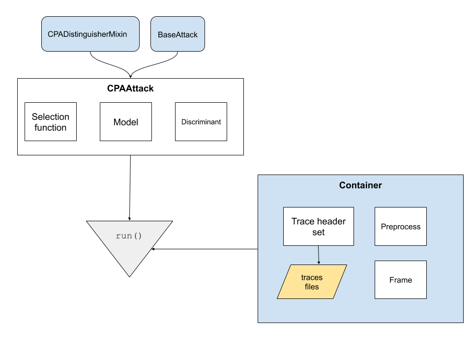

# Base concepts of scared

## Introduction

`scared` is library which aims at providing tools to achieve side-channel analysis. It provides pretty high-level APIs, ready-to-use tools to quickly runs classic CPA, DPA, ... leakage and reverse analysis.

It also provides building blocks to build your own extensions or tools.

The goal of this part of the documentation is to give an overview of the concepts and base abstractions `scared` is built on, so that the user can understand what is going under the hood, and can build her own tools when needed.

## A few lines of code

If you need to run a classical CPA attack on the DPA v2 contest trace set, you can do it with `scared` with a few lines of code:

```python
import scared
delta = scared.aes.selection_functions.encrypt.DeltaRLastRounds()
cpa_attack = scared.CPAAttack(
    selection_function=delta,
    model=scared.HammingWeight(),
    discriminant=scared.maxabs
)
ths = scared.traces.read_ths_from_ets_file('dpa_v2.ets')
container = scared.Container(ths, frame=slice(2340, 2395), preprocesses=[])
cpa_attack.run(container)
```

That's it! The attack will run and you'll find back the master key. But there is some concepts here to illustrate and explains: the selection function, the model, the CPA attack object, the trace header set and the container.

This is illustrated in the schema below. In the rest of this documentation, we will explain each one of this building block.


